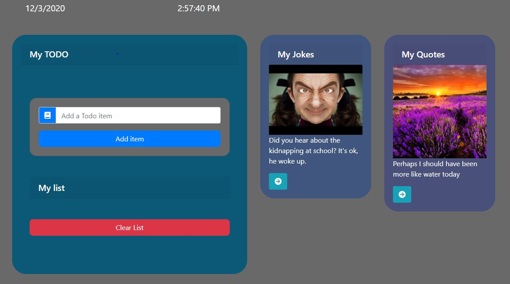

# ToDo App

This project is made with react trying to showcase simple create, edit and delete method in todo. Also have added Jokes and Quote to add fun to the app.

## Instructions

- In this app, the user can add the new todo item
- The user can also delete and edit the todo item from the list
- The joke card will show the joke and could get more by clicking the button
- The quote card will show the quote and could get more by clicking the button
- The time and date is displayed on top.
- Just click the below link to get started:

https://todo-fun.netlify.app/

## Screenshot



## Technologies used

- React
- React router dom
- React-scripts
- React-bootstrap, react-icons
- Axios
- Express
- Node
- Fontawesome

## Contributing

- Pull requests are welcome. For major changes, please open an issue first to discuss what you would like to change.

## History

```
This is a simple app I always wanted to make and have some fun side in it with a lot of logic using react,I am very happy the way it is so aimple and yet fun.
```

## Copyright

Copyright (c) [2020] [Prasamsha Sharma]
